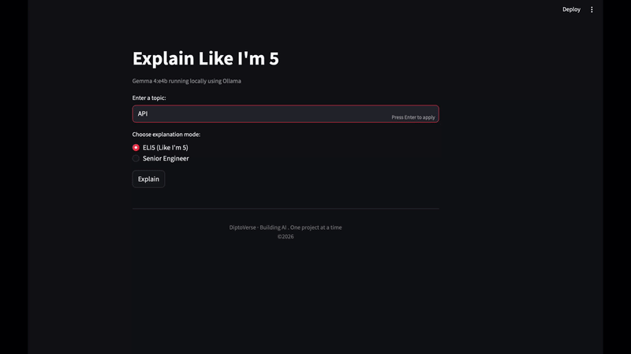
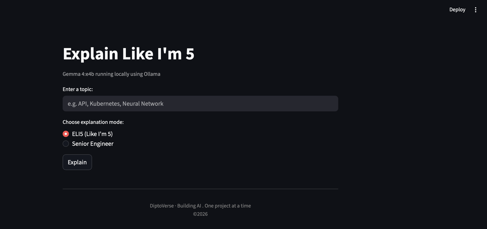
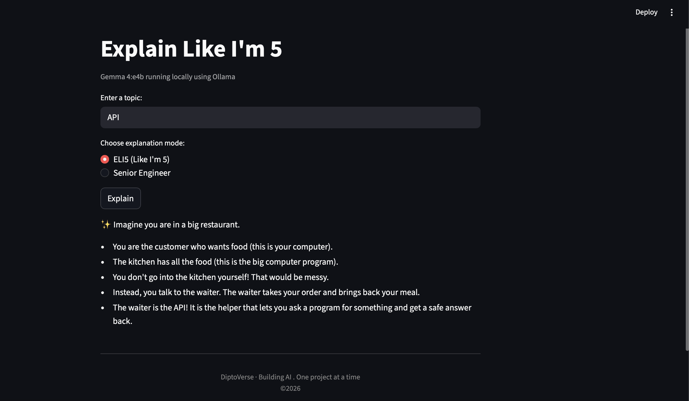
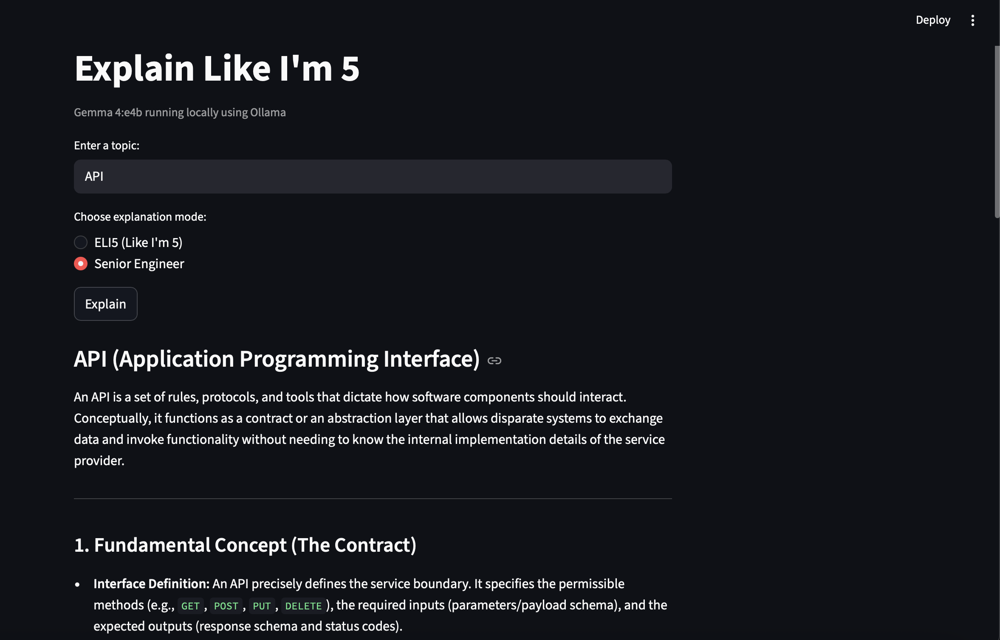

# Explain Like I'm 5

A local AI app that explains any technical topic two ways — simply, or in depth.
No API keys. No cloud. Just your machine.

## What It Does

Pick a topic. Pick a mode. Get an explanation that actually fits.

**ELI5** breaks it down using real life analogies. No jargon, no assumptions.
**Senior Engineer** goes technical. precise, Structured, and to the point.

Both run entirely on your machine using Gemma 4 (E4B) through Ollama.

## Two Modes. One Topic.

Here is what the app produces for **"API"**:

<table>
<tr>
<td width="50%" valign="top">

**ELI5: Like You're 5**

Imagine you are in a big restaurant.

You are the customer who wants food. The kitchen has all the food. You don't go into the kitchen yourself — that would be messy.

Instead, you talk to the waiter. The waiter takes your order and brings back your meal.

The waiter is the API. It's the helper that lets you ask a program for something and get a safe answer back.

</td>
<td width="50%" valign="top">

**Senior Engineer**

An API is a set of rules, protocols, and tools that dictate how software components interact. It functions as a contract, an abstraction layer that allows disparate systems to exchange data and invoke functionality without knowing the internal implementation details.

Key concerns: interface definition, decoupling, backward compatibility, versioning, and security. Common implementations include REST, GraphQL, and gRPC each with different trade offs around data fetching, contract enforcement, and serialization efficiency.

</td>
</tr>
</table>

## How It Works

The mode you select shapes the prompt. The model runs locally via Ollama. Nothing leaves your machine.

## Try These Topics

These work well in both modes:

1. Recursion
2. Docker
3. The Internet
4. Neural Network
5. Kubernetes
6. Blockchain

## Tech Stack

| Tool | Purpose |
|---|---|
| Streamlit | UI |
| Ollama | Local LLM runtime |
| Gemma 4 E4B | Language model (Google) |
| Python 3.14 | Core language |

## Screenshots

  DiptoVerse · Building AI. One project at a time. · © 2026

